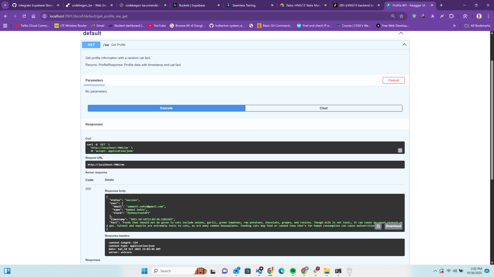
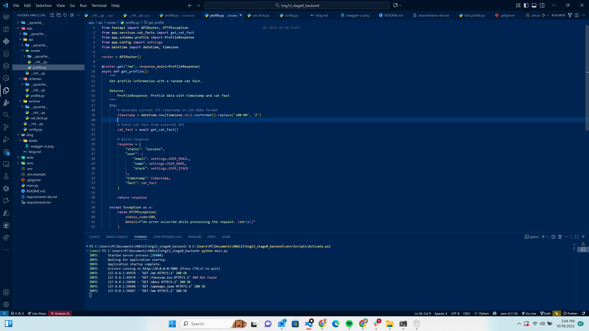
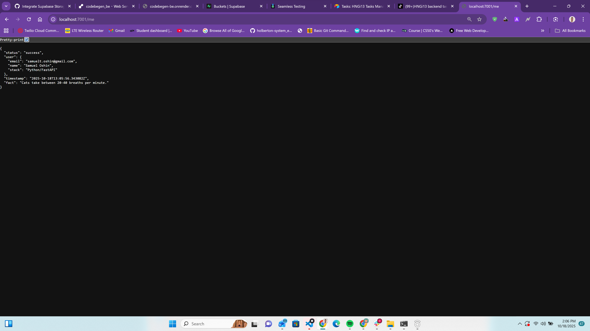

# HNGi13 Stage 0 Backend — Building a tiny resilient Profile API with Cat Facts

TL;DR: I built a minimal FastAPI backend that exposes a single endpoint, `/me`, which returns my profile details, an ISO 8601 UTC timestamp, and a fun Cat Fact from an external API. It’s resilient (graceful fallbacks on failures), typed (Pydantic models), async (httpx), and documented (Swagger + README). This post covers the why, how, lessons learned, and how you can run it yourself.

– Repo: ./ (you’re here!)
– Tech: FastAPI, Pydantic v2, httpx, Uvicorn

## What I built

- A single, production-friendly GET endpoint at `/me` that returns:
  - status: "success"
  - user: { email, name, stack }
  - timestamp: ISO 8601 in UTC (e.g., 2025-10-18T14:30:45.123Z)
  - fact: a random cat fact (with graceful fallback)
- Proper response models using Pydantic v2
- Async external call via httpx.AsyncClient with timeouts and error handling
- Config via environment variables using pydantic-settings
- CORS enabled and OpenAPI docs auto-generated

## Why this design

- Small but complete: shows real-world API ergonomics in a tiny project
- Separation of concerns: routes, schemas, services, and config
- Resilience: never breaks the happy path because of a flaky third-party
- Developer experience: quick to run, inspect, and extend

## Architecture at a glance

```
main.py (FastAPI app + CORS + routing)
└── app/
    ├── api/routes/profile.py  (GET /me)
    ├── services/cat_facts.py  (httpx client w/ timeout + fallback)
    ├── schemas/profile.py     (Pydantic models)
    └── config.py              (pydantic-settings)
```

## Key implementation details

1) ISO 8601 UTC timestamp
- I used datetime.now(timezone.utc).isoformat() and normalized the suffix to Z for a clean, interoperable timestamp.

2) Resilient external calls
- httpx.AsyncClient with a 5s timeout
- If the API is slow or down, the code returns a friendly fallback fact so `/me` stays usable

3) Typed responses with examples
- Pydantic models drive JSON schema and interactive docs at /docs and /redoc

4) Environment-driven config
- USER_EMAIL, USER_NAME, USER_STACK live in .env (template provided). This keeps code generic and portable.

## How to run locally (Windows PowerShell)

```powershell
# 1) Create & activate virtual environment (optional)
python -m venv venv
./venv/Scripts/Activate.ps1

# 2) Install deps
pip install -r requirements.txt

# 3) Configure your identity
Copy-Item .env.example .env
# then edit .env and update USER_EMAIL, USER_NAME, USER_STACK

# 4) Start the server (reload optional)
uvicorn main:app --reload --port 8000

# 5) Open docs
start http://localhost:8000/docs
```

## API: GET /me

Example response:

```json
{
  "status": "success",
  "user": {
    "email": "your.email@example.com",
    "name": "Your Full Name",
    "stack": "Python/FastAPI"
  },
  "timestamp": "2025-10-18T14:30:45.123Z",
  "fact": "Cats sleep for around 13 to 16 hours a day."
}
```

## Tests

- I added a minimal pytest test that verifies the `/me` endpoint structure and demonstrates how to mock the cat fact for deterministic results.
- Run locally:

```powershell
pip install pytest
pytest -q
```

## What this task taught me

- FastAPI + Pydantic v2 is a strong pairing for clear, validated APIs
- httpx.AsyncClient makes async I/O straightforward; timeouts are essential
- Failure isolation matters: external dependencies should not break your SLA
- ISO timestamps prevent subtle timezone parsing bugs in clients
- A tiny, well-structured project communicates craftsmanship better than a large, messy one

## What I’d improve next

- Add CI (lint + test) and pre-commit hooks
- Containerize (Docker) and add a one-command run flow
- Add tracing/metrics and basic health checks
- Add another endpoint (e.g., service health or version info)

## Screenshots / media (replace with your assets)

Below are placeholders you can replace with your own screenshots or short clips:





Tips for better engagement:
- Short 10–20s screen recording of hitting /me and opening /docs
- One carousel (LinkedIn) showing project structure, code snippets, and the JSON output

## Copy-paste captions for social

LinkedIn/Dev.to/Hashnode/Medium intro:
> I built a tiny but resilient FastAPI service that returns my profile + a random cat fact. It’s async, typed, has graceful fallbacks, and ships with docs/tests. In this write-up, I share the structure, design decisions, and lessons learned. Repo + how to run inside. #HNGi13 #FastAPI #Python #Backend #APIs

X (formerly Twitter) thread starter:
1/ I built a tiny FastAPI backend: `/me` returns my profile + a cat fact. Async httpx, Pydantic v2, timeouts, and graceful fallbacks. Docs + tests included. 🧵👇 #HNGi13 #FastAPI #Python

## Call to action

If this was helpful, star the repo and reach out—I’m open to feedback, contributions, and collaboration.
